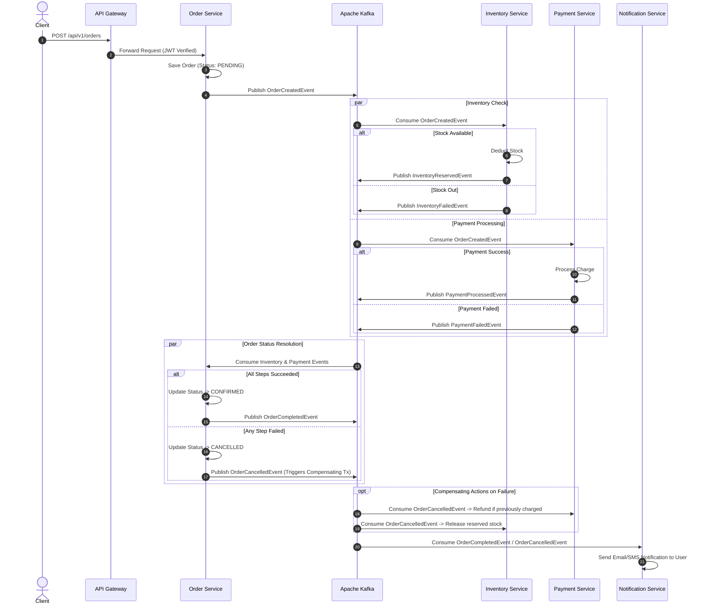

# Distributed E-Commerce System Architecture Specification

## 1. Saga Design Pattern (Choreography-Based)

In a distributed microservices environment, maintaining data consistency without two-phase commit (2PC) distributed locks is achieved using the **Saga Pattern**. We use a **Choreography-based approach**, where microservices listen to Kafka events and trigger local transactions autonomously.



---

## 2. Event Payload Schemas (Kafka Topics)

### `order-events` Topic

#### `OrderCreatedEvent`
```json
{
  "eventId": "evt_987654321",
  "eventType": "ORDER_CREATED",
  "timestamp": "2026-09-29T21:30:00Z",
  "orderId": "ord_1001",
  "customerId": "cust_5501",
  "items": [
    { "productId": "prod_77", "quantity": 2, "unitPrice": 49.99 }
  ],
  "totalAmount": 99.98
}
```

#### `InventoryReservedEvent`
```json
{
  "eventId": "evt_987654322",
  "eventType": "INVENTORY_RESERVED",
  "orderId": "ord_1001",
  "status": "SUCCESS"
}
```

#### `PaymentProcessedEvent`
```json
{
  "eventId": "evt_987654323",
  "eventType": "PAYMENT_PROCESSED",
  "orderId": "ord_1001",
  "paymentId": "pay_3002",
  "status": "SUCCESS"
}
```

---

## 3. Resilience & Fault Tolerance Strategy (Resilience4j)

1. **Circuit Breakers**:
   - Monitored inter-service HTTP requests (e.g. Order Service calling Inventory query endpoint).
   - `slidingWindowSize`: 10 requests.
   - `failureRateThreshold`: 50%.
   - `waitDurationInOpenState`: 5000ms before transition to `HALF_OPEN`.

2. **Retry & Backoff**:
   - `maxAttempts`: 3.
   - `waitDuration`: 2000ms with exponential backoff multiplier `2`.

3. **Kafka Dead Letter Queue (DLQ)**:
   - Failed Kafka message consumption after 3 retries is pushed to `order-events-dlq` topic for manual inspection/replay.

---

## 4. Observability & Distributed Tracing

- **Micrometer Tracing + Zipkin**: Automatically injects `traceId` and `spanId` into HTTP headers (`b3` format) and Kafka record headers.
- **Centralized Metrics**: Exposed via `/actuator/prometheus` endpoints on every microservice.
