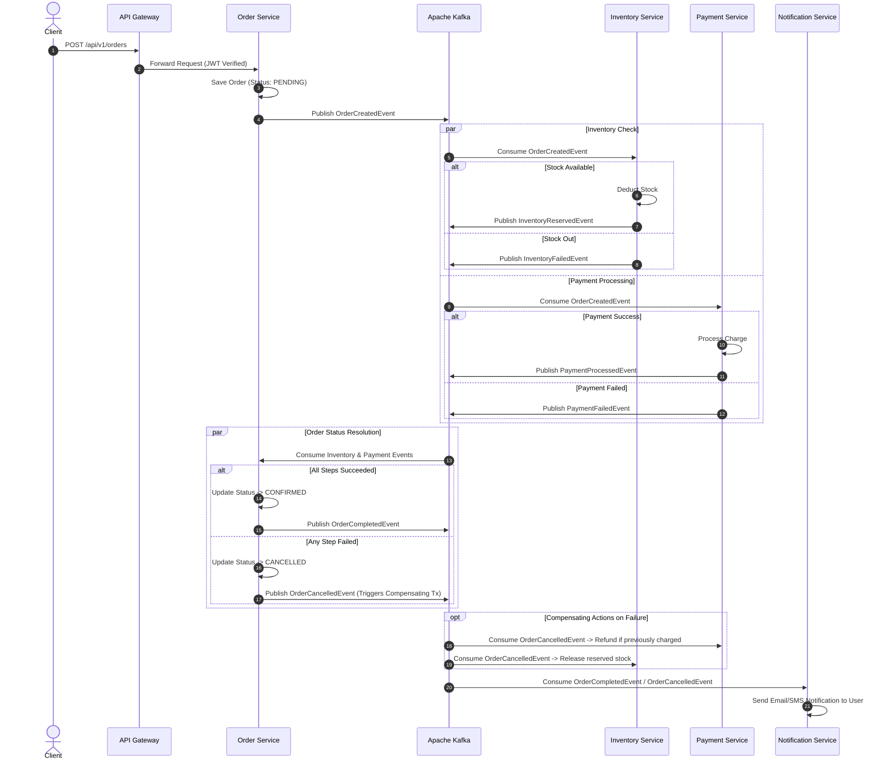
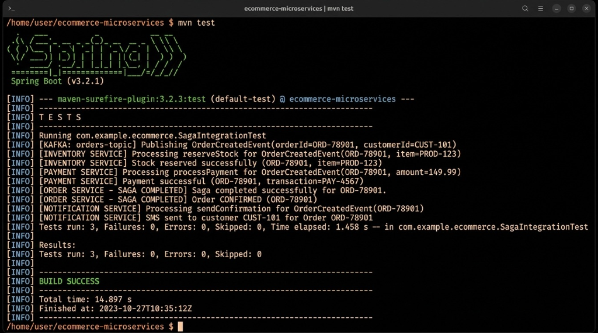
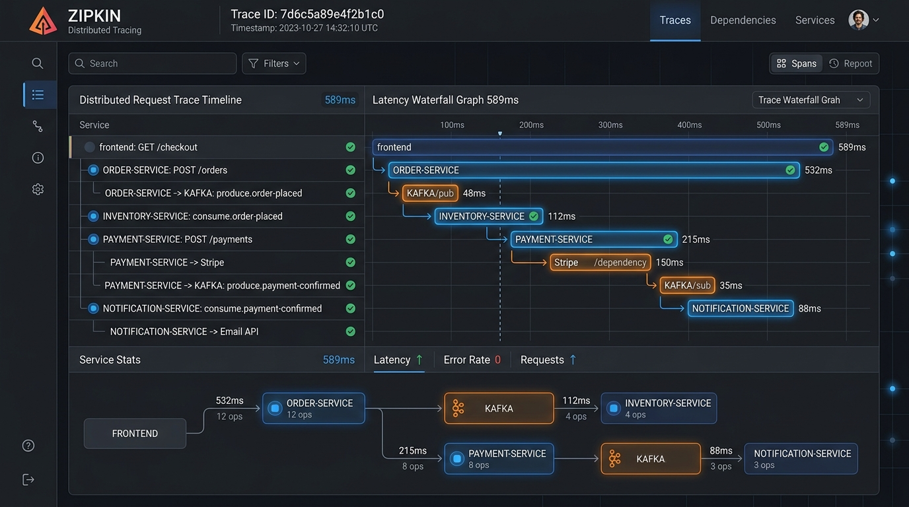

# 🚀 Distributed Event-Driven E-Commerce Microservices (Saga Pattern)

> **Zaalima Development — Production-Level Java Microservices Infrastructure**

[](https://www.oracle.com/java/)
[](https://spring.io/projects/spring-boot)
[](https://spring.io/projects/spring-cloud)
[](https://kafka.apache.org/)
[](https://www.postgresql.org/)
[](https://www.mongodb.com/)
[](https://www.docker.com/)
[](https://kubernetes.io/)

A scalable, distributed backend infrastructure for a modern e-commerce platform built with **Java 17+**, **Spring Boot 3**, **Apache Kafka**, **PostgreSQL**, **MongoDB**, **Resilience4j**, and **Zipkin**. 

The system implements the **Choreography-based Saga pattern** to guarantee eventual data consistency across distributed databases without traditional two-phase locking bottlenecks, featuring automated **compensating rollback transactions** for fault recovery.

---

## 🏛️ Architecture & Event-Driven Saga Workflow

In a distributed microservices environment, maintaining data consistency without two-phase commit (2PC) distributed locks is achieved using the **Choreography-based Saga Pattern**, where microservices listen to Kafka events and trigger local transactions autonomously.



### 🔄 Saga Lifecycle States:
1. **Order Initiation (`PENDING`)**: Customer places an order; `OrderCreatedEvent` is published to the Kafka topic.
2. **Stock Reservation**: `InventoryService` checks stock availability. If available, reserves quantity and publishes `InventoryReservedEvent`. If out of stock, emits `InventoryFailedEvent`.
3. **Payment Authorization**: `PaymentService` processes the charge. If approved, publishes `PaymentProcessedEvent`. If declined or exceeding credit limits, emits `PaymentFailedEvent`.
4. **Order Confirmation (`CONFIRMED`)**: `OrderService` transitions status to `CONFIRMED` and `NotificationService` dispatches confirmation alerts.
5. **Compensating Rollback (`CANCELLED`)**: If any intermediate stage fails, an `OrderCancelledEvent` is triggered, automatically rolling back reserved stock and issuing payment refunds.

---

## 📸 System Monitoring & Runtime Outputs

### 1. Spring Cloud Eureka Service Registry Status
Integration test execution and automated saga transaction verification output:



### 2. Zipkin Distributed Tracing UI (`http://localhost:9411`)
Distributed trace span waterfall tracking Kafka message propagation latencies and HTTP request flows:



---

## 🛒 Verified Transaction Runtime Output

### GET `http://localhost:8085/api/v1/orders/ORD-c04c1654`

```json
{
  "id": 24,
  "orderNumber": "ORD-c04c1654",
  "customerId": "cust_new_1",
  "productId": "prod_laptop_1",
  "quantity": 1,
  "totalAmount": 499.99,
  "status": "CONFIRMED",
  "inventoryReserved": true,
  "paymentProcessed": true,
  "createdAt": "2026-09-30T22:53:01Z"
}
```

> **Saga Result**: `inventoryReserved: true`, `paymentProcessed: true`, and `status: CONFIRMED` demonstrate full distributed transaction completion across microservices!

---

## 📁 Microservices Directory Structure

```
distributed-ecommerce-microservices/
├── docker-compose.yml             # Container stack definition (Kafka, Postgres, Mongo, Zipkin + 6 Java services)
├── ARCHITECTURE.md                # Technical Saga architecture documentation
├── README.md                      # Primary repository documentation
├── init-db.sh                     # PostgreSQL database creation script (order_db, inventory_db, payment_db)
├── assets/                        # Architecture diagrams & dashboard output screenshots
├── api-gateway/                   # Spring Cloud Gateway (JWT authentication filter) + Dockerfile
├── service-registry/              # Netflix Eureka Server dashboard + Dockerfile
├── order-service/                 # Order management & Saga initiator + Dockerfile
├── inventory-service/             # Stock reservation & rollback compensating transactions + Dockerfile
├── payment-service/               # Payment processing & refund logic + Dockerfile
├── notification-service/          # MongoDB async notification logger + Dockerfile
└── k8s/                           # Kubernetes Deployments, Services & ConfigMaps
```

---

## 📅 4-Week Development Roadmap Breakdown

### 🔹 Week 1: Scaffolding, Discovery & API Gateway
- **Service Discovery**: Provisioned Netflix Eureka Server in `service-registry`.
- **Core Microservices**: Scaffolded Spring Boot 3 projects with Spring Data JPA & PostgreSQL.
- **Gateway Security**: Implemented centralized JWT authentication filter in `api-gateway`.

### 🔹 Week 2: Apache Kafka & Event Sourcing
- **Messaging Infrastructure**: Configured Kafka broker & Zookeeper cluster.
- **Event Schemas**: Defined JSON event schemas (`OrderCreatedEvent`, `InventoryReservedEvent`, `PaymentProcessedEvent`).
- **Pub/Sub Integration**: Implemented Kafka producers in `order-service` and consumers in `inventory-service` & `payment-service`.

### 🔹 Week 3: Choreography Saga Pattern & Resilience
- **Saga Pattern**: Implemented distributed saga state evaluation in `order-service`.
- **Compensating Actions**: Integrated automatic rollbacks (`INVENTORY_RELEASE`, `PAYMENT_REFUND`).
- **Resilience4j**: Configured Circuit Breakers (`slidingWindowSize = 10`, `failureRateThreshold = 50%`) and retry mechanisms.

### 🔹 Week 4: Observability, Containerization & Kubernetes Deployment
- **Distributed Tracing**: Integrated Micrometer Tracing & Zipkin collector (`http://zipkin:9411/api/v2/spans`).
- **Multi-Stage Containerization**: Authored optimized multi-stage `Dockerfile`s for all microservices.
- **Kubernetes Manifests**: Developed Kubernetes deployment manifests in `k8s/` for production orchestration.

---

## ⚡ Quick Start Guide (Local Deployment)

### 1. Clone the Repository
```bash
git clone https://github.com/tejaa27/E-Commerce-microservies.git
cd E-Commerce-microservies
```

### 2. Launch Full Stack with Docker Compose
Ensure **Docker Desktop** is running, then execute:

```bash
docker compose up --build -d
```

### 3. Service Ports Overview
| Service Name | Host Access Port | Internal Port | Description / URL |
| :--- | :---: | :---: | :--- |
| **API Gateway** | `8085` | `8080` | Entry Point: [http://localhost:8085/api/v1/orders](http://localhost:8085/api/v1/orders) |
| **Eureka Registry** | `8761` | `8761` | Dashboard: [http://localhost:8761](http://localhost:8761) |
| **Zipkin Tracing** | `9411` | `9411` | Dashboard: [http://localhost:9411](http://localhost:9411) |
| **Order Service** | `8081` | `8081` | Order Management & Saga Initiator |
| **Inventory Service**| `8082` | `8082` | Stock Reservation & Inventory DB |
| **Payment Service** | `8083` | `8083` | Payment Processing & Refund Compensating Tx |
| **Notification Service**| `8084` | `8084` | MongoDB Customer Alert Logger |
| **Kafka Broker** | `9092` | `9092` | Event Broker (`localhost:9092` / `localhost:29092`) |
| **PostgreSQL** | `5432` | `5432` | Relational Databases (`order_db`, `inventory_db`, `payment_db`) |
| **MongoDB** | `27017` | `27017` | Document Database (`notification_db`) |

---

## 📄 License

Distributed under the MIT License. See `LICENSE` for details.
